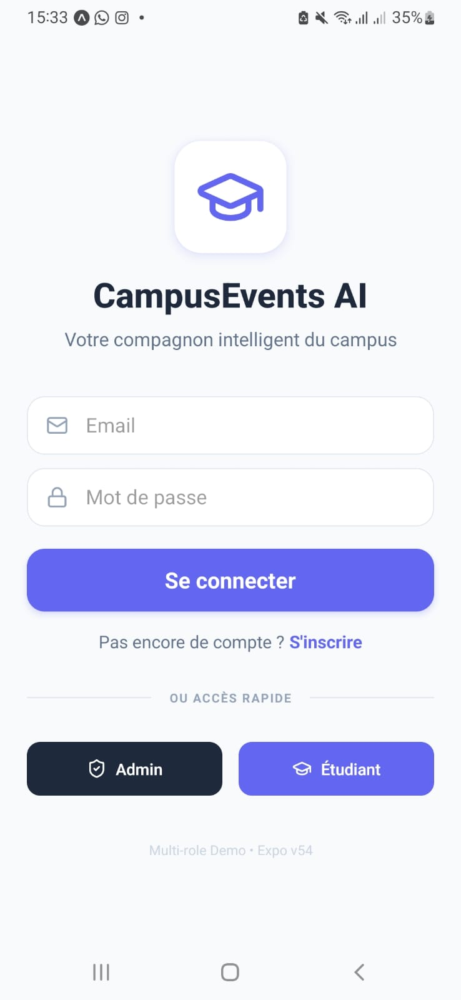
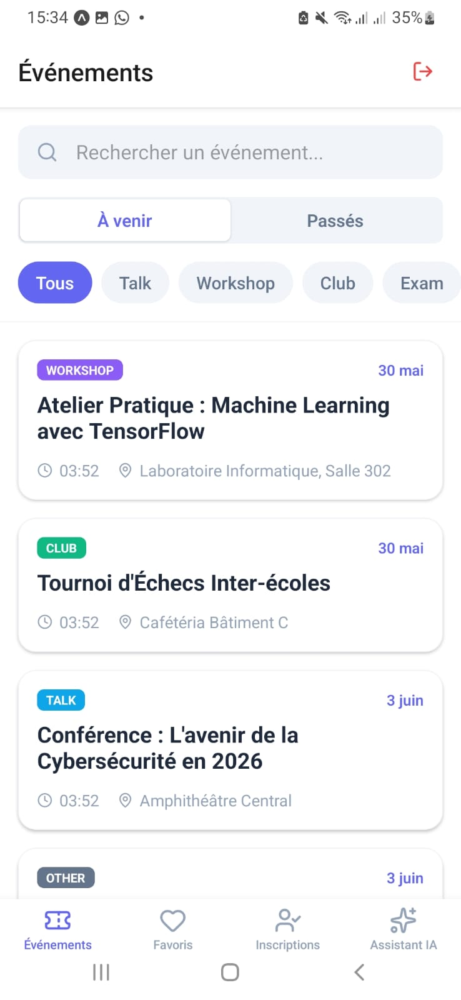
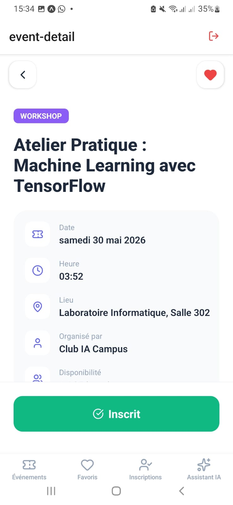
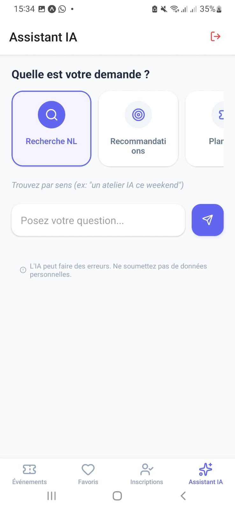
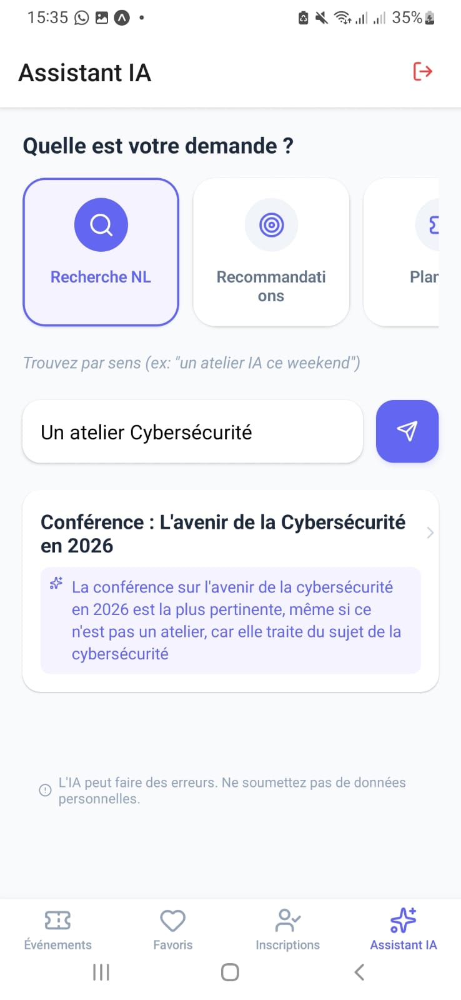
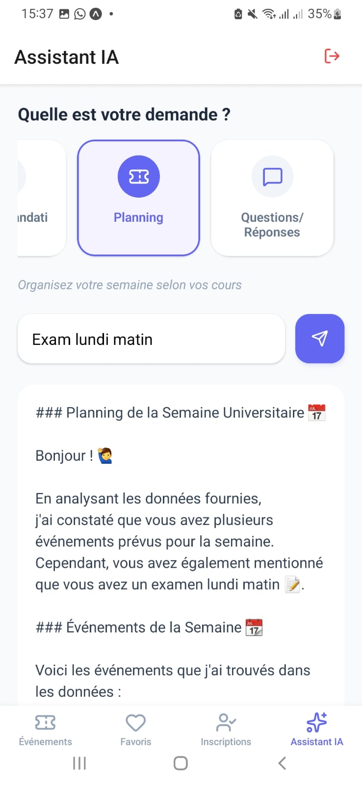
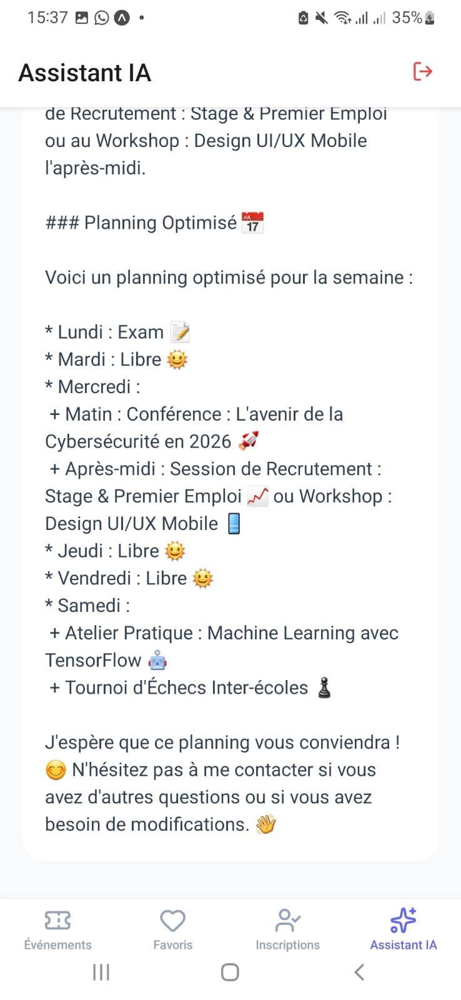
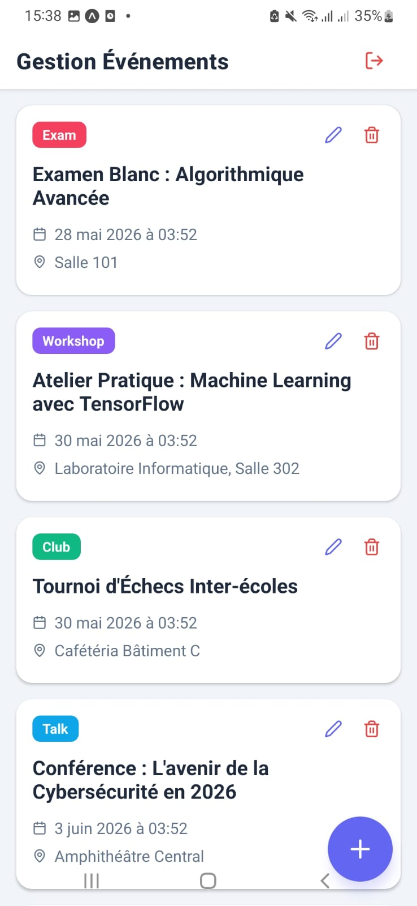
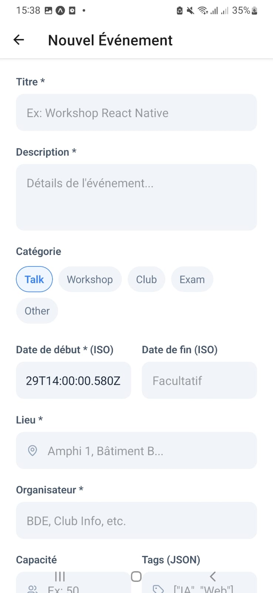

# 🎓 CampusEvents AI

**CampusEvents AI** est une application mobile moderne et intelligente conçue pour dynamiser la vie universitaire. Elle permet aux étudiants de découvrir des événements, de gérer leur emploi du temps et de recevoir des suggestions personnalisées grâce à une intelligence artificielle intégrée.

---

## 📸 Aperçu de l'application

Voici les différentes interfaces de l'application :

| **Authentification** | **Catalogue Étudiant** | **Détails Événement** |
|:---:|:---:|:---:|
|  |  |  |

| **Mes Favoris** | **Mes Inscriptions** | **Assistant IA** |
|:---:|:---:|:---:|
|  |  |  |

| **Recommandations** | **Recherche Sémantique** | **Planning (1/2)** |
|:---:|:---:|:---:|
|  |  |  |

| **Planning (2/2)** | **Dashboard Admin** | **Gestion d'Événement** |
|:---:|:---:|:---:|
|  |  |  |

---

## 🚀 Fonctionnalités Clés

### 🤖 Assistant IA (Powered by Groq & Llama 3)
- **Recherche NL (Langage Naturel)** : Trouvez des événements par sens (ex: "un atelier pour apprendre le code ce soir") plutôt que par mots-clés exacts.
- **Recommandations Personnalisées** : L'IA analyse vos favoris et inscriptions passées pour vous suggérer les 3 meilleurs événements à venir.
- **Planning Intelligent** : Organisez votre semaine en fonction de vos contraintes et cours.
- **Mode Q&A** : Posez des questions sur le catalogue global du campus.

### 📅 Gestion des Événements
- **Filtres Avancés** : Recherche par catégorie (Talk, Workshop, Club, Exam) et période.
- **Inscriptions & Favoris** : Gérez votre participation et gardez un œil sur les événements qui vous intéressent.
- **Notifications & Statuts** : Confirmation d'inscription en temps réel.

### 🔐 Administration
- Création, modification et suppression d'événements.
- Suivi du nombre de participants et de la capacité des salles.

---

## 🛠️ Stack Technique

- **Framework** : [Expo](https://expo.dev/) (React Native)
- **Langage** : TypeScript
- **Base de données** : SQLite (persistance locale via `expo-sqlite`)
- **IA** : API Groq Cloud (Modèles Llama 3.1 & 3.3)
- **UI/Icons** : Lucide React Native, Styles Vanilla
- **Gestion d'états** : Context API (Auth)

---

## 📦 Installation et Configuration

### 1. Cloner le projet
```bash
git clone https://github.com/ahyahya1616/compus-events.git
cd compus-events
```

### 2. Installer les dépendances
```bash
npm install
```

### 3. Configurer l'environnement
Créez un fichier `.env` à la racine du projet et ajoutez votre clé API Groq :
```env
EXPO_PUBLIC_GROQ_API_KEY=votre_cle_gsk_ici
```

### 4. Lancer l'application
```bash
npx expo start
```
*Utilisez l'application **Expo Go** sur votre téléphone pour scanner le QR Code.*

---

## 👥 Comptes de Test

| Rôle | Email | Mot de passe |
| :--- | :--- | :--- |
| **Administration** | `admin@campus.ma` | `admin123` |
| **Étudiant** | `etudiant@campus.ma` | `etudiant123` |

---

## 📄 Licence
Ce projet est réalisé dans un cadre académique. Tous droits réservés.
